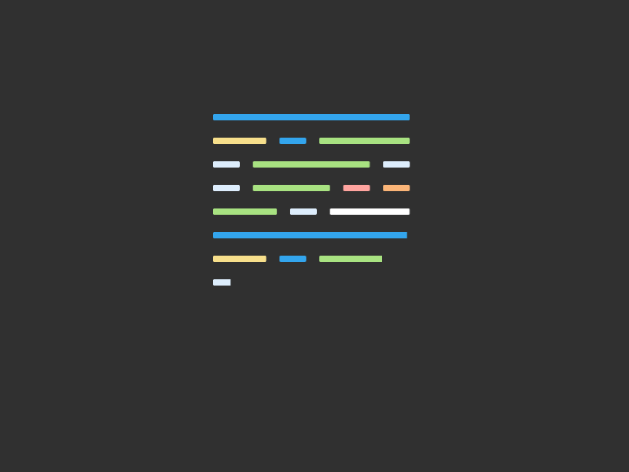
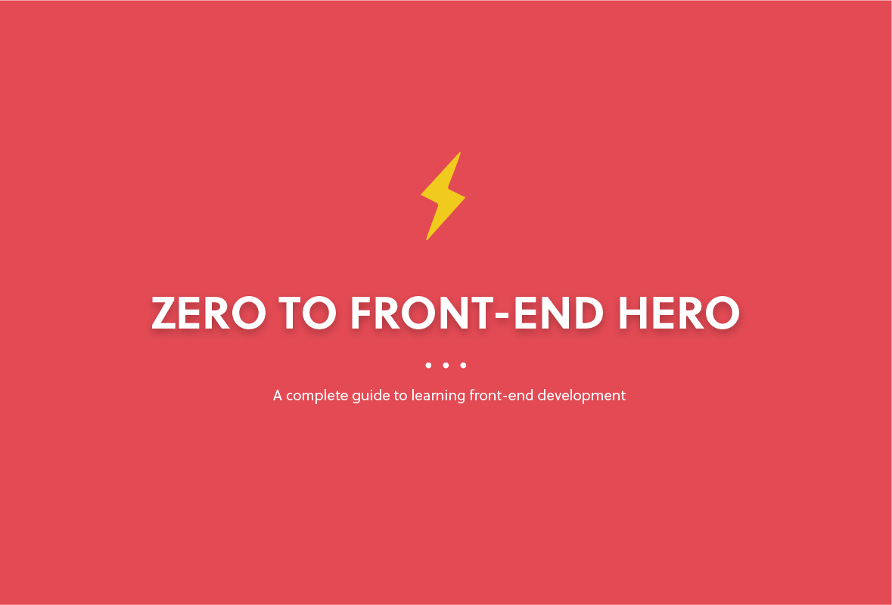
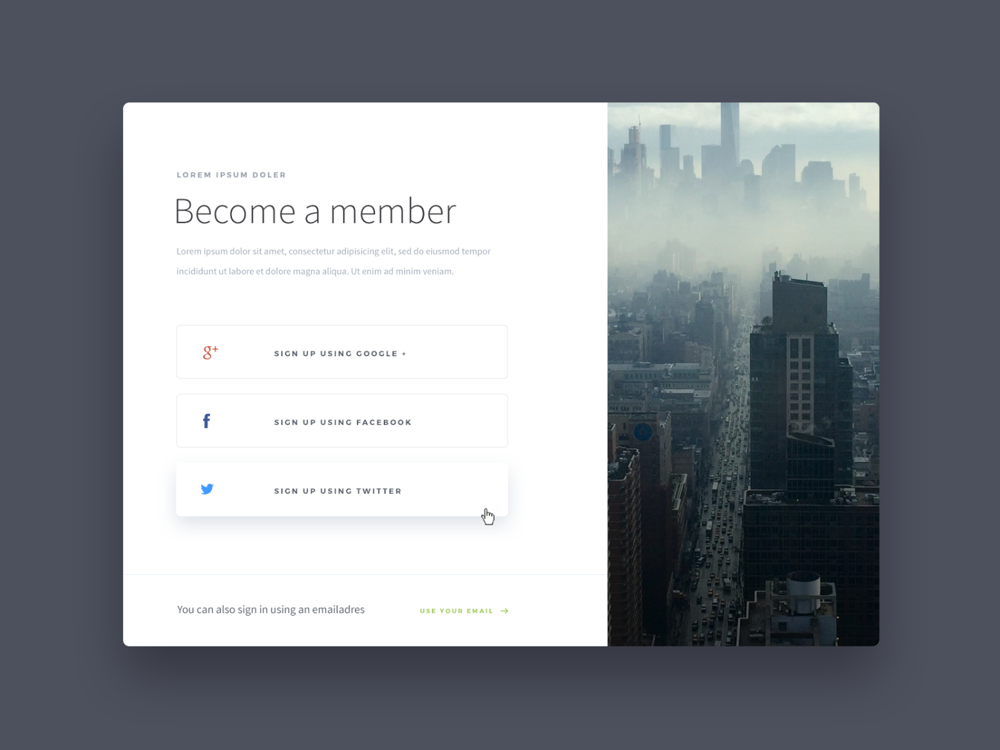
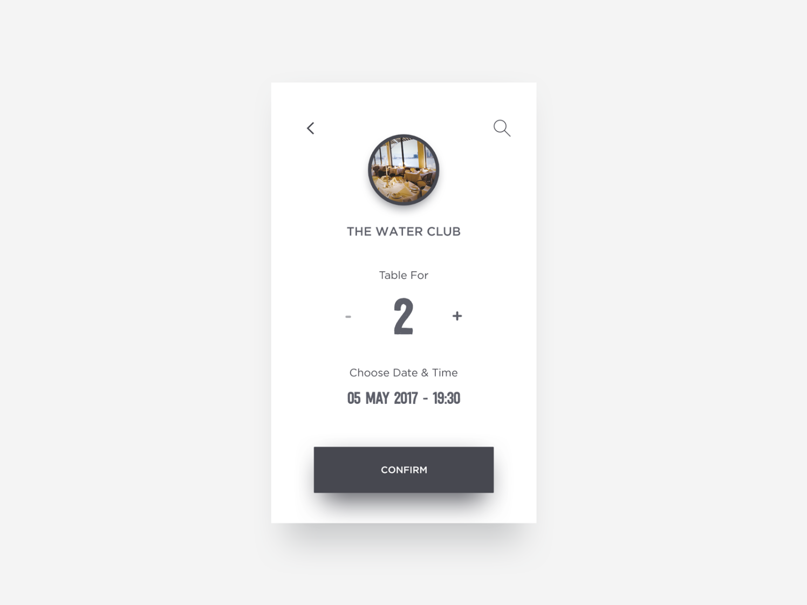
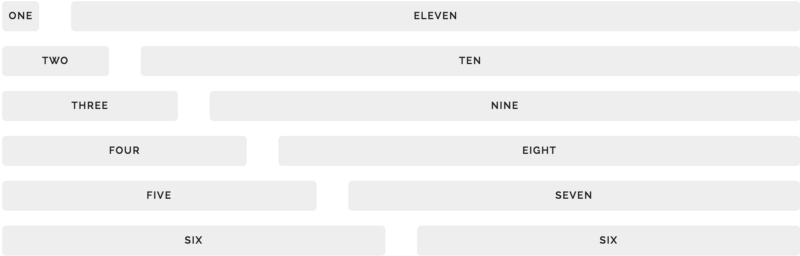
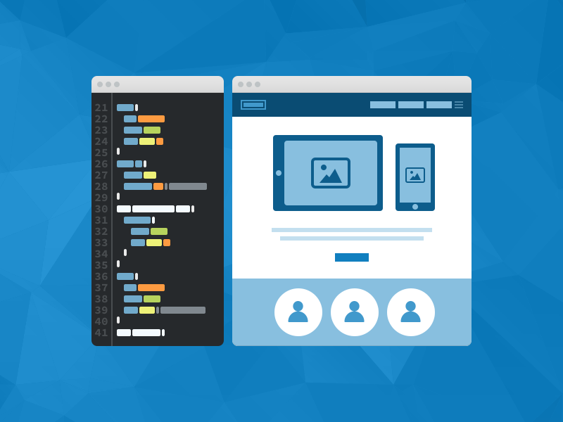
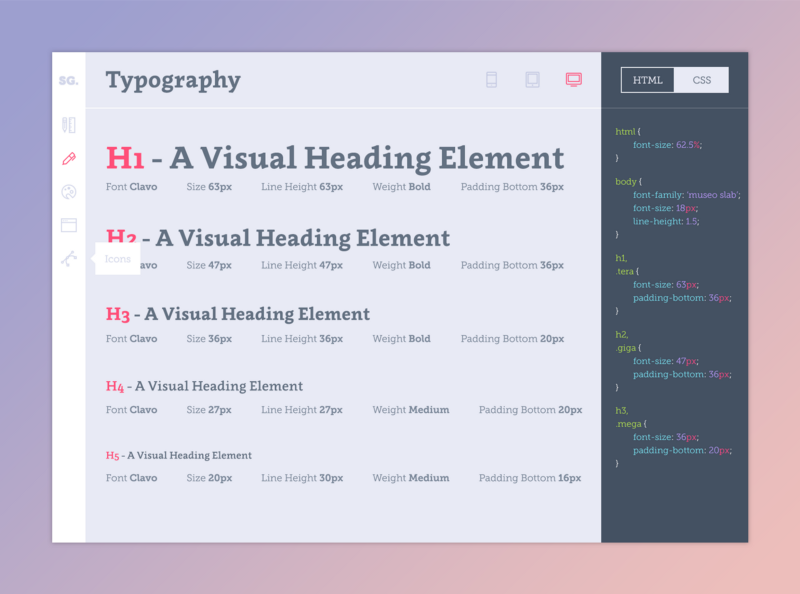

## HTML and CSS basics

In front-end development, everything starts with [HTML][WikiHTML] 
and [CSS][WikiCSS]. HTML and CSS control what you see on a web page. HTML dictates 
content while CSS handles styling and layout.

To get started, read the [HTML][MozillaHTML] and [CSS][MozillaCSS] tutorials by Mozilla 
Developer Network(MDN). The MDN provides chapter-by-chapter explanations of important 
HTML and CSS concepts. In addition, each chapter is only a page long, with interactive 
demos linked out to CodePen and JSFiddle.

After completing those tutorials, take a look at the Make a Website course by CodeAcademy. 
This tutorial only takes a few hours to complete, and is a good primer for building 
websites with HTML and CSS. If you want more, Building web forms is another tutorial by 
CodeAcademy that takes you through building and styling a web form.

For practice with CSS, try out [CSS Diner][CSSDiner]. It’s a fun CSS challenge game. 
Another important aspect of HTML and CSS are layouts. [LearnLayout][LearnLayout] 
is an interactive tutorial that shows you how to create layouts with HTML and CSS.

Also, learn how to use [Google Fonts][GoogleFonts] with [Basics of Google Font API][GoogleFontsAPI] 
by CSSTricks. Typography is a fundamental building block of interfaces. When you 
have time, I would highly recommend you read this free online book, 
[Professional Web Typography][ProWebType] by Donny Truong. It teaches you everything 
you need to know about typography as a front-end developer.

Throughout these resources, don’t worry too much about memorizing things. Instead, 
focus on understanding how HTML and CSS work together.

## Practicing HTML and CSS Basics

Now that you have a basic grasp of HTML and CSS, let’s have some fun. In this 
section, there are two experiments designed to give you practice building 
websites and interfaces. I use the term “experiments” because in experiments, 
you learn as much from your failure as you do from your success.

### Experiment 1

In our first experiment, we are going to use [CodePen][CodePen]. CodePen is a front-end 
playground where you can code HTML and CSS without having to store files locally. 
It also has live previews that update as soon as you save your code.

By using CodePen, you kill two birds with one stone. On one hand, you practice 
HTML and CSS. On the other hand, you create a basic progress portfolio. We are 
also going to use [Dribbble][Dribble], which is a site full of design inspiration.

Go to Dribbble and find a design that is simple enough to code in a few hours. 
I selected a few designs to get you started: [1][Dribble-1], [2][Dribble-2], 
[3][Dribble-3], [4][Dribble-4], and [5][Dribble-5]. I chose mobile-first 
web designs because they are less complex than their desktop counterparts. 
However, feel free to choose desktop designs as well.

After you’ve decided on a design, go ahead and try coding it in CodePen. If you 
get stuck, remember that [StackOverflow][StackOverflow] is your friend. Another useful practice is 
to go on websites like [Medium][Medium, [AirBnB][AirBnB, and [Dropbox][Dropbox] 
and using the [inspector tool][ChromeDevTool] to see how they achieve different 
layouts and styles. Also, take a look at some of the [pens on CodePen][CodePen-1]. 
I picked out a few good references:

+ [Menu App Interface][CodePen-2]
+ [Twitter Widget][CodePen-3]
+ [Article News Card][CodePen-4]
+ [Simple Flat Menu][CodePen-5]

If your copy looks different from the original, don’t be discouraged. Keep practicing with different designs and you’ll notice improvement each time.

If you don’t have a design background, it’s likely your design eye is underdeveloped. A front-end developer with a good design eye will be able to identify good designs and replicate them perfectly. I wrote an article a few weeks ago on how to develop your design eye.

### Experiment 2

Hopefully the first experiment gave you some confidence with writing HTML and CSS. 
For experiment 2, we’re going to take a look at some sites, then code a few of 
their components.

Some websites use CSS frameworks or obfuscate their CSS classnames, making it 
hard for you to read their source code. That is why I selected a few well-designed 
websites with easy to read source code.

+ [Dropbox for Business][DropboxBusiness]: Try replicating their [hero][WikiHeroImage] section
+ [AirBnB][AirBnB]: Try replicating their footer
+ [PayPal][PayPal]: Try replicating their navigation bar
+ [Invision][Invision]: Try replicating their signup section at the bottom of the page
+ [Stripe][Stripe]: Try replicating their payments section

Once again, the focus of experiment 2 is not to recreate the entire page. 
Although that certainly wouldn’t hurt! Choose a couple of key components like a 
navigation bar or a hero section to code. I provided a suggestions next to the 
list of sites but feel free to choose other components.

You can code this experiment in CodePen or store it locally. If you choose to store 
it locally, you can either download this example project as a boilerplate or create 
the files from scratch. I suggest using an editor like Atom or Sublime.

Also, keep in mind that for any website, you can always see its HTML and CSS. Just 
right click the page or a component on the page, click inspect, and a panel will pop 
up with the HTML on the left and the CSS on the right. Once you are done or get stuck, 
use the inspector to see how your HTML and CSS compare.

## HTML and CSS Best Practices

So far what you’ve been learning are the basics of HTML and CSS. The next step 
is to learn best practices. Best practices are a set of informal rules that 
improve the quality of your code.

### Semantic Markup

One of the best practices for HTML and CSS is to write semantic markup. Good web 
semantics means using appropriate HTML tags and meaningful CSS class names to 
convey structural meaning.

For example, the h1 tag tells us that the text it wraps is an important heading. 
Another example would be the footer tag, which tells us that the element belongs 
at the bottom of the page. For further reading, read A Look Into Proper HTML5 
Semantics and What Makes For a Semantic Class Name by CSSTricks.

### CSS Naming Conventions

The next important best practice for CSS is proper naming conventions. Good naming 
conventions, like semantic markup, convey meaning and help make our code predictable, 
readable, and maintainable. You can read about the different naming conventions 
in the article OOCSS, ACSS, BEM, SMACSS: what are they? What should I use?

In general, I suggest trying out simple naming conventions that make intuitive 
sense to you. Over time, you’ll discover ones that work best for you. To see how 
companies like Medium utilize naming conventions like BEM, read Medium’s CSS is 
actually pretty f***ing good. In that article, you’ll also learn that coming 
up with an effective set of CSS conventions is an iterative process.

### CSS Reset

Browsers have small styling inconsistencies from margins to line-heights. For 
this reason, always reset your CSS. MeyerWeb is a popular reset. If you want to 
dig deeper, you can read Create Your Own Simple Reset.css File.

## Cross Browser Support

Cross browser support means that your code supports most up-to-date browsers. 
Some CSS properties like transition need vendor prefixes to work properly in 
across different browsers. You can read more about vendor prefixes in this 
article, CSS Vendor Prefixes. The main take away is that you should test your 
website across multiple browsers including Chrome, Firefox, and Safari.

### CSS Preprocessors and Postprocessors

Since the introduction of CSS in 1990s, CSS has come a long way. Since UI 
systems have become increasingly complex, people came up with tools known as 
preprocessors and postprocessors to manage complexity.

CSS preprocessors are CSS language extensions that add bells and whistles like 
variables, mixins, and inheritance. The two main CSS preprocessors are Sass and 
Less. In 2016, Sass is generally more widely used. Bootstrap, the popular 
responsive CSS framework, is switching from Less to Sass as well. Also, when 
most people talk about Sass, they’re actually talking about SCSS.

CSS postprocessors apply changes to CSS after it has been either hand written 
or compiled by a preprocessor. For example, some postprocessors like PostCSS 
have plugins that add browser vendor prefixes automatically.

When you first discover CSS preprocessors and postprocessors, it’s tempting to 
use them everywhere. However, start off simple and add extensions like variables 
and mixins only when necessary. The article I suggested earlier, Medium’s CSS is 
actually pretty good, also covers how much is too much when it comes to preprocessors.

### Grid Systems and Responsiveness

Grid systems are CSS structures that let you stack elements horizontally and vertically.

Grid frameworks like Bootstrap, Skeleton, and Foundation provide stylesheets 
that manage rows and columns in layouts. While grid frameworks are useful, it’s 
also important to understand how grids work. Understanding CSS Grid Systems and 
Don’t Overthink Grids are great overviews.

One of the main purposes of grid systems is to add responsiveness to your website. 
Responsiveness means that your website resizes based on window width. A lot of 
times responsiveness is achieved by using CSS media queries, CSS rules that only 
only apply to certain screen widths.

You can read more about media queries in Intro to Media Queries. Also, because 
we have entered a mobile-first era, check out An Introduction to Mobile-First 
Media Queries.

## Practicing HTML and CSS Best Practices

Now that you are armed with best practices, let’s battle test them. The goal of 
these next two experiments is to practice writing clean code and observing the 
long term effect of best practices on readability and maintainability.

### Experiment 3

For experiment 3, pick one of your previous experiments and refactor your code 
using some of the best practices you’ve learned. Refactoring means editing your 
code so that it’s easier to read and less complex.

Being able to effectively refactor code is an important skill of a front-end 
developer. Creating quality code is an iterative process. CSS Architectures: 
Refactor Your CSS is a good starting point for refactoring your code.

Here are a few things to ask yourself when you are refactoring your code.

+ Are your class names ambiguous? 6 months from now, will you still understand 
what your class name means?
+ Is your HTML and CSS semantic? When glancing at your code are you able to 
quickly discern structural and relational meaning?
+ Are you reusing the same hex color code over and over again in your code? 
Would it make more sense to refactor it into a Sass variable?
+ Does your code work just as well on Safari as it does on Chrome?
+ Could you replace some of your layout code with a grid system like Skeleton?
+ Are you using the !important flag often? How can you fix that?

### Experiment 4

The last experiment put what you’ve learned about best practices to use. 
However, the effects of best practices often don’t become apparent until you 
apply them to a bigger project.

For the last experiment, build yourself a portfolio website. As a front-end, 
your portfolio site is one of your most important digital assets. A portfolio 
is a site that showcases your work. More importantly, it’s an on-going record 
that helps you track your progress and development. So even if you only have 1 
or 2 things to show, put it up.

To get started, follow along with Adham Dannaway’s article, My (Simple) Workflow 
To Design And Develop A Portfolio Website

If your first portfolio iteration isn’t perfect, that’s okay. Portfolios go through 
many iterations. And, what’s important that you built it with your own skills.

## Stay current

While HTML and CSS won’t go out of vogue anytime soon, it’s important to stay up 
to date with the front-end landscape.

Below is a list of websites, blogs, and forums that are both enjoyable to read 
and informative.

+ CSSTricks
+ Smashing Magazine
+ Designer News
+ Nettuts+
+ CSS Wizard

### Learn by example

Finally, the best way to learn is by example. Here are a set of styleguides and 
code conventions that will teach you how to be a more effective front-end.

#### Styleguides

Web styleguides are collections of CSS components and patterns that can be reused 
across a website. The key thing to note from these styleguides is how component 
based HTML and CSS approaches allow you to reuse code to keep your code DRY.

+ Mapbox
+ LonelyPlanet
+ SalesForce
+ MailChimp

## Code Conventions

Code conventions designed to make your code readable and maintainable. Some of 
these links like CSS Guidelines are guidelines for writing better HTML and CSS 
while other links like Github internal CSS toolkit and guidelines are examples 
of quality code.

+ CSS Guidelines
+ Github internal CSS toolkit and guidelines
+ AirBnB’s CSS Styleguide

## Wrap up

Hopefully by the end of this article, you are familiar with HTML and CSS and 
have a few projects under your belt. The best way to learn front-end is by 
building projects and experimentation. Remember, every front-end developer has 
to start somewhere. And it’s better to start today than tomorrow.

Written by [@JonathanZWhite](https://twitter.com/JonathanZWhite)

> This article is the first of a two part series. The second article covers adding 
>[interactivity with Javascript and Javascript libraries/frameworks][PartII].

[PartII]: https://medium.com/free-code-camp/from-zero-to-front-end-hero-part-2-adfa4824da9b
[WikiHTML]: https://en.wikipedia.org/wiki/HTML
[WikiCSS]: https://en.wikipedia.org/wiki/Cascading_Style_Sheets
[WikiHeroImage]: https://en.wikipedia.org/wiki/Hero_image
[MozillaHTML]: https://developer.mozilla.org/en-US/docs/Web/Guide/HTML/Introduction
[MozillaCSS]: https://developer.mozilla.org/en-US/docs/Web/Guide/CSS/Getting_Started/What_is_CSS
[CSSDiner]: http://flukeout.github.io/
[LearnLayout]: http://learnlayout.com/
[GoogleFonts]: https://www.google.com/fonts
[GoogleFontsAPI]: https://css-tricks.com/snippets/css/basics-of-google-font-api/
[ProWebType]: https://prowebtype.com/
[CodePen]: http://codepen.io/
[CodePen-1]: http://codepen.io/pens/
[CodePen-2]: http://codepen.io/ManarKamel/pen/BooXJw
[CodePen-3]: http://codepen.io/cameronbaney/pen/gfjLJ
[CodePen-4]: http://codepen.io/jonathanzwhite/pen/GZVKmE
[CodePen-5]: http://codepen.io/Jeplaa/pen/adnoH
[Dribble]: https://dribbble.com/
[Dribble-1]: https://dribbble.com/shots/2262761-Mobile-Blog-App-Interface/attachments/424147
[Dribble-2]: https://dribbble.com/shots/2492038-Task-List-App/attachments/489171
[Dribble-3]: https://dribbble.com/shots/2144170-Day-014-Location-Card/attachments/392323
[Dribble-4]: https://dribbble.com/shots/2639709-Confirm-Reservation/attachments/528798
[Dribble-5]: https://dribbble.com/shots/2314157-Daily-UI-Day-1/attachments/439137
[StackOverflow]: https://stackoverflow.com
[Medium]: https://medium.com
[AirBnB]: https://airbnb.com
[DropBox]: https://dropbox.com
[DropBoxBusiness]: https://www.dropbox.com/business
[ChromeDevTool]: https://developer.chrome.com/devtools
[Paypal]: https://www.paypal.com/home
[Invision]: http://www.invisionapp.com/
[Stripe]: https://stripe.com/us/pricing

