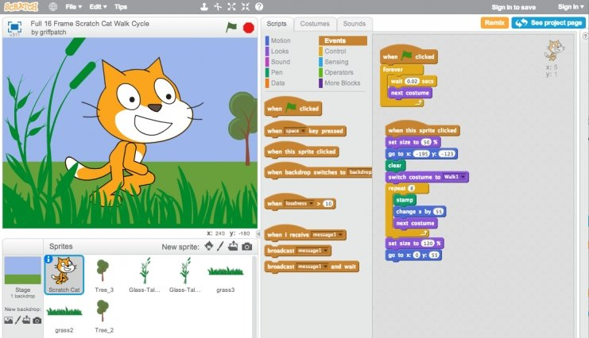

This is week 0. Like I said in my last post, each week has a problem set. 
Problem sets are exercises meant to test your knowledge, ability and understand 
of the lecture and topic. But I think there’s more to that.

Week 0 centers on developing a programmer’s mindset, to think like a computer. 
Starting with the basics of programming and programming concept, things like 
ASCII, Algorithm, Binary etc. focusing on a programming language called 
[Scratch](https://scratch.mit.edu/).

## Scratch

Scratch is a programming language developed by MIT Lab. The language is very 
basic and easy to understand and it’s best for kids and new programmers. The 
language is more graphical and uses pseudo-code. It comprises of building 
blocks of code which the user has to click and drag. Just like every other 
programming language, it has functions, loops, condition and variable etc. 
With Scratch, you can make interactive stories, games and animations. It is 
the perfect way to start algorithm.

## Mission

This week’s problem set is to develop a program in Scatch. The mission is 
simply, quite simply, to have fun with Scratch and implement a project of your 
choice (be it an animation, a game, interactive art, or anything else), subject 
to the following requirements.

+ Your project must have at least two sprites, at least one of which must resemble something other than a cat.
+ Your project must have at least three scripts total (i.e. not necessarily three per sprite).
+ Your project must use at least one condition, one loop, and one variable.
+ Your project must use at least one sound.
+ Your project should be more complex than most of those demonstrated in lecture.

## Objectives

+ Understand how information can be represented digitally.
+ Leverage some fundamental programming constructs.
+ Design your own animation, game, or interactive art.

## My Scratch

Building a Scratch program was something I needed a little time. First, I needed 
to download the offline version of Scratch since I don’t have the best Internet. 
I had to also get acquainted with the interface, the building blocks and all.

At first, I didn’t know what to build. I had a lot of ideas, I just wasn’t sure 
which one to go for – making a game or an interactive story. I wanted to keep it 
simple, and so I decided to make a simple game called RPS (Rock, Paper, Scissors).

To be honest, making the game with Scratch was fun. I got to enjoy the colorful 
blocks, and the simple click and drags. It was more like a game, a brick game 
to be exact. I wouldn’t like to bore you with the details on how I made it. You 
can check it [here](https://scratch.mit.edu/projects/138361661).

    <iframe src="https://scratch.mit.edu/projects/138361661/embed" 
        allowtransparency="true" width="485" height="402" frameborder="0" 
        scrolling="no" allowfullscreen>
    </iframe>

